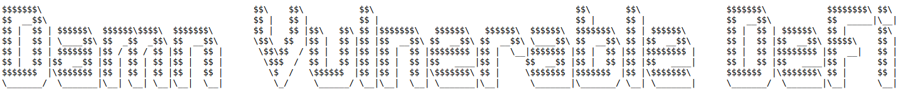

**A set of challenges to hack implementations of DeFi in Ethereum.** Featuring flash loans, oracles, governance, NFTs, lending pools, and more!

Created by [@tinchoabbate](https://twitter.com/tinchoabbate) at OpenZeppelin

## Play

Visit [damnvulnerabledefi.xyz](https://damnvulnerabledefi.xyz)!

## Troubleshooting

- Some users have reported [issues](https://github.com/OpenZeppelin/damn-vulnerable-defi/issues/1) with specific versions of node. I have succesfully installed all dependencies, and executed all challenges, with version `v12.20.0`. If you're using a different version of node and are having problems during the setup, try switching to version `v12.20.0`.
- Some users have reported [issues](https://github.com/OpenZeppelin/damn-vulnerable-defi/pull/4) with the timeout set in the `package.json` file for "The Rewarder" challenge. If you're having trouble executing your exploit for this challenge, try increasing the timeout.

## Disclaimer

All Solidity code, practices and patterns in this repository are DAMN VULNERABLE and for educational purposes only.

DO NOT USE IN PRODUCTION.
